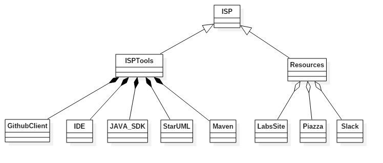

# # Sample project template for ISP (SE) labs

Project dependencies:
- Maven 3 
- Java 1.8 (11 or 17)

In order to run the project, execute the following command from the root directory (pom.xml should be in this path).

At run time, the main method of the class specified in the pom.xml file through the 'mainClass' property will be called:

    <mainClass>Example</mainClass>

To pass arguments in the command line when using maven, the element 'commandlineArgs' in the pom.xml file will be modified according to the following example:

    <commandlineArgs>-jar ${project.build.directory}/${project.build.finalName}-${shadedClassifierName}.jar arg1 arg2</commandlineArgs>

## Running the tests

To run the unit tests, execute the following command: 

    mvn test

## Running the application 

    mvn compile exec:java 

## Default running

To perform a complete compile, test and run cycle execute the command:

    mvn

Through the 'mvn' command, maven will run the 'default maven goals' set in the pom.xml file, namely:

    <defaultGoal>clean compile package exec:java</defaultGoal> 

## Alternate run using mvn wrapper

Alternatively, the previous commands can be run using the mvn wrapper (https://github.com/takari/maven-wrapper); the 'mvnw' command can be used if maven is not installed. Example:

    mvnw test 
    
## Generating the javadoc documentation

To generate the project documentation, the next command will be executed:

    mvn javadoc:javadoc
   
## The ISP (SE) laboratory tools

     

