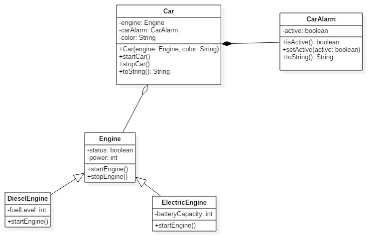
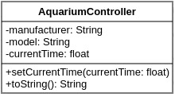
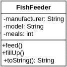
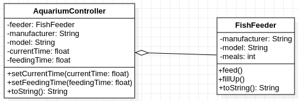
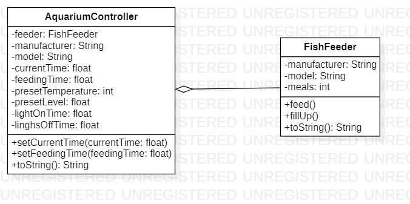
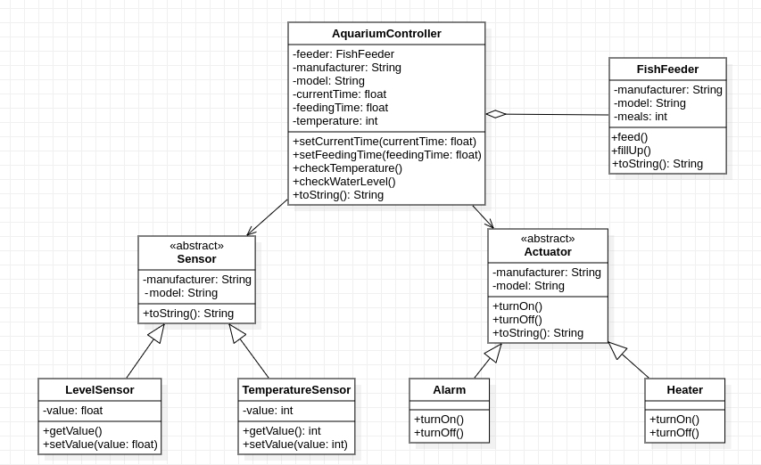
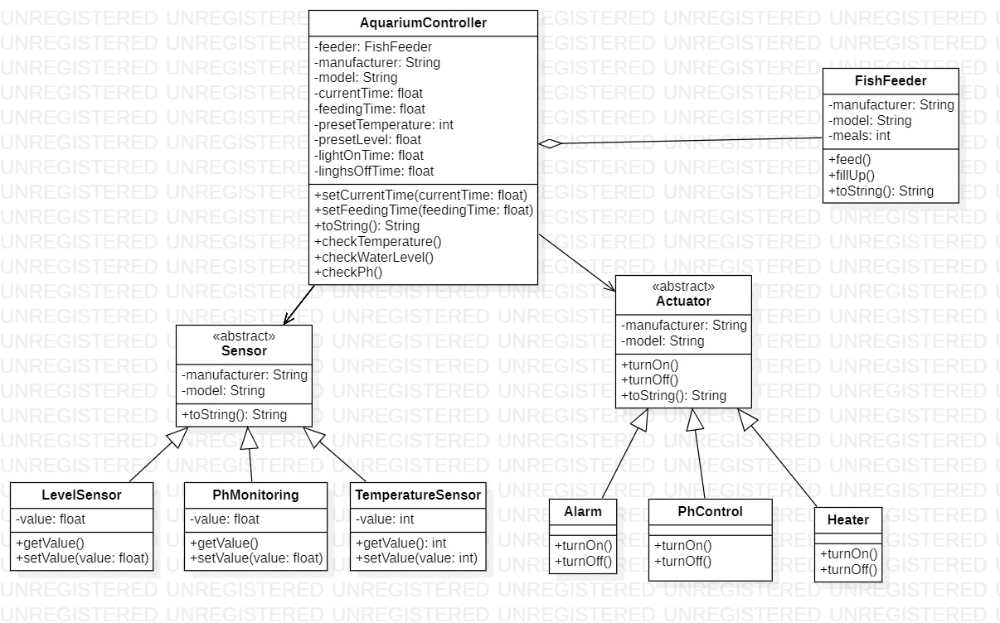

# Implement the following exercises

In this lab you will create small Java applications by using as reference an UML class diagram. Please consider following general notes before start implementing:
- toString() method when required will return a string like *ClassName{attributeName1=attributeValue1,...,attributeNamen=attributeValuen}*.
- Do not reuse (import) the same class in multiple exercises. **Each exercise is standalone and should be resolved in its package.**
- Create any additional constructors, getters and setters needed by your [unit] tests.

## Exercise 0

This exercise demonstrate concepts you will need to apply in this lab. Solution for this diagram can be found in source folder in package *isp.lab4.exercise0*.

**NOTE: This exercise do not require any implementation from student.**

**The following exercises model the control of a fish aquarium, step by step**

## Exercise 1

Given the UML class diagram above, implement the corresponding Java program.

1. Create Java class based on the diagram above. 
2. Instantiate and test created class in the provided Exercise 1 main method.
3. Create a minimal unit test for testing the behavior of the created class.

## Exercise 2

The automatic fish feeder is a very useful addition to any aquarium.
Our fish feeder has two operations and a maximum capacity of 14 meals.
Once the fill up operation is called, the meals attribute has to be reset to 14
and a message should be displayed in the console. The feed operation will decrease
the number of meals by 1, and will also display a proper message into the console. 

1. Create Java class based on the diagram above. 
2. Instantiate and test created class in the provided Exercise 2 main method.
3. Create minimal unit tests for the behavior of the created classes.

## Exercise 3 

Now let's assemble the two components. Each time the current time is modified
(i.e. setCurrentTime() is called), the controller checks if it's feeding time.
If it is, then it triggers the feed operation. The time is represented as a flot,
e.g. 2.30 or 14.50 (ignore validation errors for now). 

1. Create Java classes based on the diagram above. 
2. Instantiate and test created classes in the provided Exercise 3 main method.
3. Create minimal unit tests for the behavior of the created classes.

## Exercise 4

Extend exercise 3 and implement the aquarium's lights control.
Algae can be a real problem in any aquarium, and to much light time will boost their growth.
But if the plant don't get enough light they will die. Keep the lights on anywhere between 6 to 8 hours per day. 
You need to add 2 new attributes for: lightOnTime and lightsOffTime.
Like in the case of the previous exercise, turning the lights on/off is determined when setting the current time in the controller.

1. Update the class diagram from exercise 3 with the newly added subsystem.
   The docs directory contains the StarUML model. You can use it to modify ex3 diagram. Export it as ex4.jpg and add the image to docs.
2. Create Java classes based on your new diagram.
3. Instantiate and test created classes in the provided Exercise 4 main method.
4. Create minimal unit tests for the new behavior.

## Exercise 5 

The water temperature is not very important for the majority of the plants, but it is for the fish.
For tropical fish species somewhere between 24-27°C is recommended.
We also want a leak detection subsystem.

1. Create Java classes based on the diagram above.
   - the controller checks the water level; if it's below the preset value it turns on the alarm.
   - the controller checks the temperature; if it's below the preset value it turns on the heater;
   if the temperature equals the preset value, it turns the heater off.
2. Instantiate and test created classes in the provided Exercise 5 main method.
3. Create minimal unit tests for the new behavior.

## Exercise 6 

Modify exercise 5 and add pH monitoring/control.
Determine if it's possible to change the water pH without killing the fish.
If it can be done implement the control. If not, only raise an alarm.

1. Create the new class diagram.
2. Implement the code and the unit tests. 

