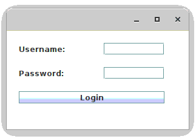
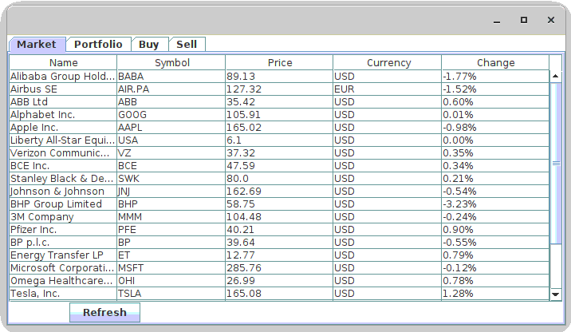
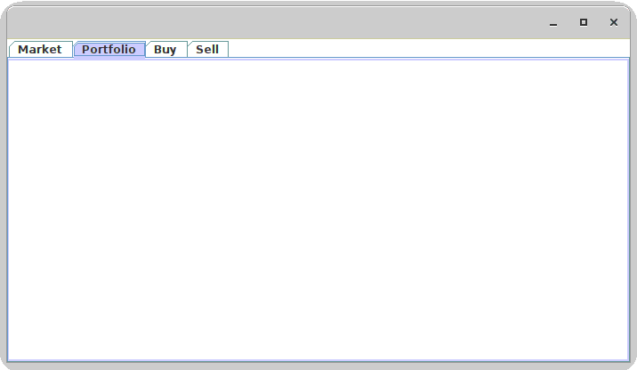
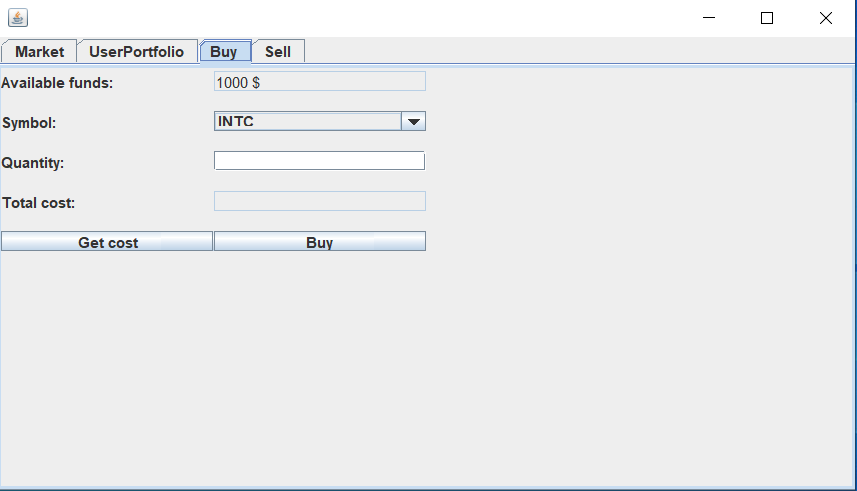
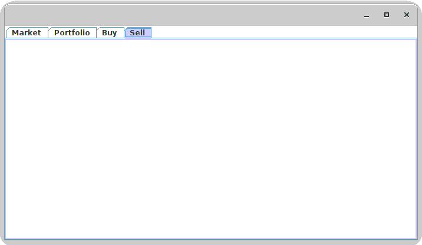

# Lab 9

**Stocks Portfolio Management Application**

Note: The project uses Lombok. 
Please install the Lombok plugin. **In IntelliJ: File->Settings...->Plugins - search 'Lombok'**

## Exercise 1 

Implement a basic stock portfolio tracker application starting from the example provided in package exercise 1.

The aplication should provide following functionalities:
- Authentication (Login) - finish the login implementation. Currently, the credentials are not verified; anyone can access the application.

- View market stocks and their current value - this feature is implemented and can be used as reference for next exercises;

- View user portofolio owned stocks
    - View owned stocks in a table view similar to Market;
    - For each owned stock display in table followings: symbol, quantity, price per unit, total price of the position;
    - Also add available funds (cash).

- Buy stock:
    - Implement "Buy" button functionality;
    - Buy is limited by available cache funds (stored in Portfolio class, attribute "cash");

- Sell stock
    - Create user interface similar to Buy interface
    - Symbol dropdown button should display only stocks owned by user;
    - When the sell is completed, the available funds should increase with the value of the transaction;

 

### Implementation notes

Note 1 - Stock symbols are hardcoded in StockMarketQueryService      private String[] symbols = new String[] {"INTC", "BABA", "TSLA", "AIR.PA", "MSFT", "AAPL", etc.}; You can add your own symbol as long as correspond to some real market symbols.

Note 2 - For getting financial market information the application use https://financequotes-api.com/ library:

        <dependency>
            <groupId>com.yahoofinance-api</groupId>
            <artifactId>YahooFinanceAPI</artifactId>
            <version>3.15.0</version>
        </dependency>

## Exercise 2

Create UML Class diagram and insert it bellow.

----- UML CLASS DIAGRAM -------

## Exercise 3 (Optional)

Study MVC design pattern and how this can be implemented in Java. Here is a link presenting how MVC pattern can be implemented:
- https://examples.javacodegeeks.com/core-java/java-swing-mvc-example/ 

## Exercise 4 (Optional)

Add a layer of persistence to your application:
- Save the accounts in a file on the disk.
- Save the user's portfolios on the disk. Keep in mind that you can have multiple users.
- You can use either Java's native serialization support or the JSON format.